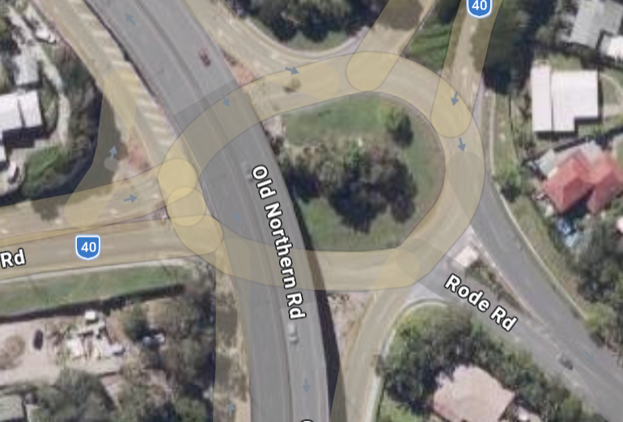
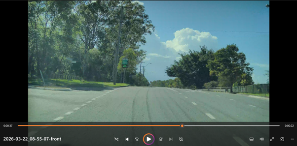
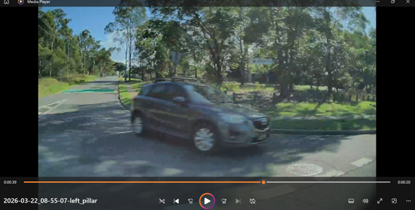

**Important note: New events will no longer be added to the list below due to the large and continually growing volume. Please visit one of the YouTube channels instead: [White Box Autonomy](https://www.youtube.com/@WhiteBoxAutonomy/videos) or [White Box Autonomy Archive](https://www.youtube.com/@WhiteBoxAutonomyArchive).**\

### Event 1

**System**: Tesla Model Y FSD 2026\
**Context**: Highway\
**Country**: Australia\
**Date**: 14 March 2026\
**Type**: Speed limit confusion\
**Event**: During a trip to North Lakes Costco, while travelling on the Bruce Highway near IKEA in a posted 80 km/h zone, FSD appeared limited to about 60 km/h, despite the vehicle display showing an 80 km/h speed limit. Manual acceleration was possible, but once pedal input was released, the vehicle decelerated back to below 60 km/h.\
**Outcome**: Safe. Following vehicles became impatient and overtook. FSD returned to normal behaviour once the speed limit increased to 100 km/h.\
**Source**: Own experience\
**Video link**: A similar incident happened a couple of weeks later. here is the [Youtube](https://www.youtube.com/watch?v=hHcswC6Zzc0).

### Event 2

**System**: Tesla Model Y FSD 2026\
**Context**: Suburb\
**Country**: Australia\
**Date**: 15 March 2026\
**Type**: Potentially risky right turn\
**Event**: Tesla FSD initiated a right turn slightly early—ultimately safe, but briefly appeared to come close to a vehicle traveling straight in the opposite direction.\
**Outcome**: Safe.\
**Source**: Own experience\
**Video link**: [Youtube](https://www.youtube.com/watch?v=86hAfbAgojQ)

### Event 3

**System**: Tesla Model Y FSD 2026\
**Context**: Suburb\
**Country**: Australia\
**Date**: 8 March 2026\
**Type**: Excessive speed for conditions\
**Event**: Tesla FSD was driving along Robinson Road in Aspley at the 50 km/h speed limit. While not exceeding the limit, the rough, bumpy surface near the curb caused significant shaking, making the ride feel unsafe. My daughter became frightened, so I quickly disengaged FSD.\
**Outcome**: Safe.\
**Source**: Own experience\
**Video link**: No video. The road surface image is below:

### Event 4

**System**: Tesla Model Y FSD 2026\
**Context**: Suburb\
**Country**: Australia\
**Date**: 17 March 2026\
**Type**: Narrow and crowded local road\
**Event**: Tesla FSD navigates a busy local street smoothly, like an experienced driver.\
**Outcome**: impressive.\
**Source**: Own experience\
**Video link**: [Youtube](https://youtu.be/A25X8p71jko)

### Event 5

**System**: Tesla Model Y FSD 2026\
**Context**: Suburb\
**Country**: Australia\
**Date**: 18 March 2026\
**Type**: Seemingly confused \
**Event**: Tesla FSD hesitated in traffic and began moving in behind a parked roadside car; I quickly intervened to correct it, prompting another driver to honk—the first time I’ve experienced this with FSD.\
**Outcome**: frustrating.\
**Source**: Own experience\
**Video link**: [Youtube](https://www.youtube.com/watch?v=brQ_h95wU5E)

### Event 6

**System**: Tesla Model Y FSD 2026\
**Context**: Highway\
**Country**: Australia\
**Date**: February 2026\
**Type**: Missing trailer detection\
**Event**: On a trip to UQ, while passing under an overhead bridge, I noticed that a SUV towing a trailer directly ahead was displayed as just a SUV—the trailer was not detected. A possible reason is that the trailer was mostly grey and blended with the pavement, and the bridge shadow may have further reduced contrast.\
**Outcome**: Safe, as FSD was not engaged—but this could have been a concern otherwise.\
**Source**: Own experience\
**Video link**: No video, but the location is shown in the image below.

\

### Event 7

**System**: Tesla Model Y FSD 2026\
**Context**: Suburb\
**Country**: Australia\
**Date**: March 2026\
**Type**: Tesla FSD smoothly navigates a complex roundabout\
**Event**: Tesla FSD smoothly navigates an exceptionally complex roundabout—one of the most intricate I’ve encountered. I deliberately challenged FSD with this scenario, and it handled it impressively.\
**Outcome**: Impressive.\
**Source**: Own experience\
**Video link**: [Youtube](https://www.youtube.com/watch?v=faa6Rh7QjiI); The full view is shown in the image below.

### Event 8

**System**: Tesla Model Y FSD 2026\
**Context**: Suburb\
**Country**: Australia\
**Date**: March 2026\
**Type**: Tesla FSD Honours "Keep Clear"\
**Event**: Tesla FSD slowly follows the vehicle in front on a busy road and then comes to a complete stop before the "Keep Clear" zone.\
**Outcome**: Impressive.\
**Source**: Own experience\
**Video link**: [Youtube](https://www.youtube.com/watch?v=8g6e1aIc3_A);

### Event 9

**System**: Tesla Model Y FSD 2026\
**Context**: Suburb\
**Country**: Australia\
**Date**: March 2026\
**Type**: Exiting from the main road\
**Event**: Tesla FSD performs a smooth exit from the main road.\
**Outcome**: Impressive.\
**Source**: Own experience\
**Video link**: [Youtube](https://www.youtube.com/watch?v=-AV3BxJv-Y0);

### Event 10

**System**: Tesla Model Y FSD 2026\
**Context**: Suburb\
**Country**: Australia\
**Date**: March 2026\
**Type**: Confused by a small bridge\
**Event**: Tesla FSD turned onto a narrow bridge with a pedestrian refuge in the middle, became confused, and began drifting toward oncoming traffic, requiring immediate intervention.\
**Outcome**: FSD disengaged.\
**Source**: Own experience\
**Video link**: [Youtube](https://www.youtube.com/watch?v=FVrgiWqpXR4);

### Event 11

**System**: Tesla Model Y FSD 2026\
**Context**: Suburb\
**Country**: Australia\
**Date**: March 2026\
**Type**: Confused on a local road\
**Event**: Tesla FSD became confused on a small local road with a speed limit of 20 km/h, and began drifting toward oncoming traffic, requiring immediate intervention.\
**Outcome**: FSD disengaged.\
**Source**: Own experience\
**Video link**: [Youtube](https://www.youtube.com/watch?v=FYwk9AVX6ck);

### Event 12

**System**: Tesla Model Y FSD 2026\
**Context**: Suburb\
**Country**: Australia\
**Date**: March 2026\
**Type**: Merging into the busy traffic on a main road\
**Event**: Tesla FSD patiently waited for its opportunity to merge into the busy traffic on a main road.\
**Outcome**: Impressive.\
**Source**: Own experience\
**Video link**: [Youtube](https://www.youtube.com/watch?v=d0eZ1oNydx0) from the right pillar view.

### Event 13

**System**: Tesla Model Y FSD 2026\
**Context**: Suburb\
**Country**: Australia\
**Date**: March 2026\
**Type**: Merging into one lane\
**Event**: Tesla FSD clears a busy intersection and merges into one lane.\
**Outcome**: Impressive.\
**Source**: Own experience\
**Video link**: [Youtube](https://www.youtube.com/watch?v=mgH3aED1fks);

### Event 14

**System**: Tesla Model Y FSD 2026\
**Context**: Suburb\
**Country**: Australia\
**Date**: March 2026\
**Type**: Speed limit confusion in a school zone\
**Event**: Tesla FSD maintained 40 km/h on a 70 km/h road, failing to recognize that the school zone speed limit was no longer in effect. Drivers behind became impatient, and I had to repeatedly press the accelerator as FSD seemed reluctant to speed up.\
**Outcome**: Frustrating.\
**Source**: Own experience\
**Video link**: [Youtube](https://www.youtube.com/watch?v=BJTlp67JACU);

### Event 15

**System**: Tesla Model Y FSD 2026\
**Context**: Suburb\
**Country**: Australia\
**Date**: March 2026\
**Type**: Failed to stop at the stop line\
**Event**: Tesla FSD failed to stop at the stop line, and I had to intervene and stop the car to avoid a potential conflict with another vehicle.\
**Outcome**: Near miss.\
**Source**: Own experience\
**Video link**: [Youtube](https://www.youtube.com/watch?v=bpRwmcos9S4);

### Event 16

**System**: Tesla Model Y FSD 2026\
**Context**: Suburb\
**Country**: Australia\
**Date**: March 2026\
**Type**: FSD Takes a Roller-Coaster Ride\
**Event**: This stretch of the Brisbane Inner City Bypass—aka my son’s “roller coaster bridge”—gave FSD a fun challenge. It didn’t quite stick to the speed limits (30 km/h then 60 km/h), but otherwise handled the ride like a champ.\
**Outcome**: Impressive.\
**Source**: Own experience\
**Video link**: [Youtube](https://youtu.be/X-t_o2WCaX0);

### Event 17

**System**: Tesla Model Y FSD 2026\
**Context**: Suburb\
**Country**: Australia\
**Date**: March 2026\
**Type**: FSD makes an aggressive lane changing\
**Event**: That’s probably not something I would have done.\
**Outcome**: Potentially risky.\
**Source**: Own experience\
**Video link**: [Youtube](https://youtu.be/6320eHP1P6E);

### Event 18

**System**: Tesla Model Y FSD 2026\
**Context**: Suburb\
**Country**: Australia\
**Date**: March 2026\
**Type**: FSD has a friendly interaction with a pedestrian\
**Event**: Apparently, the pedestrain didn't notice I was not the one who was driving the car :-)\
**Outcome**: Impressive.\
**Source**: Own experience\
**Video link**: [Youtube](https://youtu.be/t4VpQ6fJ18E);

### Event 19

**System**: Tesla Model Y FSD 2026\
**Context**: Suburb\
**Country**: Australia\
**Date**: March 2026\
**Type**: FSD changed lanes too late\
**Event**: FSD changed lanes too late; I had to intervene to avoid missing the turn.\
**Outcome**: Potentially risky.\
**Source**: Own experience\
**Video link**: [Youtube](https://youtu.be/a23hlxFTNbc);

### Event 20

**System**: Tesla Model Y FSD 2026\
**Context**: Suburb\
**Country**: Australia\
**Date**: March 2026\
**Type**: FSD's first encounter of the so-called traffic light dilemma\
**Event**: Overall, FSD performed well—there’s nothing to complain about; after all, this is known as the “traffic light dilemma” in traffic engineering literature.\
**Outcome**: Potentially risky or impressive?\
**Source**: Own experience\
**Video link**: [Youtube](https://youtu.be/MUZ_I9ND4D4);

### Event 21

**System**: Tesla Model Y FSD 2026\
**Context**: Suburb\
**Country**: Australia\
**Date**: March 2026\
**Type**: Merging into another lane without turning on the indicator\
**Event**: FSD merged into another lane without using the indicator. This was risky given the heavy traffic during the afternoon rush hour.\
**Outcome**: Potentially risky.\
**Source**: Own experience\
**Video link**: [Youtube](https://youtu.be/LoqiOk5hsRE);

### Event 22

**System**: Tesla Model Y FSD 2026\
**Context**: Suburb\
**Country**: Australia\
**Date**: March 2026\
**Type**: Lane departure\
**Event**: This happened when Tesla FSD was merging onto the Bruce Highway.\
**Outcome**: Potentially risky.\
**Source**: Own experience\
**Video link**: [Youtube](https://youtu.be/uAPe_-a5cJc);

### Event 23

**System**: Tesla Model Y FSD 2026\
**Context**: Suburb\
**Country**: Australia\
**Date**: March 2026\
**Type**: Lane departure\
**Event**: This happened when Tesla FSD was travelling on a local road.\
**Outcome**: Potentially risky.\
**Source**: Own experience\
**Video link**: [Youtube](https://youtu.be/gXhnwt4bpFQ);

### Event 24

**System**: Tesla Model Y FSD 2026\
**Context**: Suburb\
**Country**: Australia\
**Date**: March 2026\
**Type**: Lane departure\
**Event**: This happened when Tesla FSD was travelling on a local road with dashed yellow edge line.\
**Outcome**: Potentially risky.\
**Source**: Own experience\
**Video link**: [Youtube](https://www.youtube.com/watch?v=2iEaVyNT4Bg);

### Event 25

**System**: Tesla Model Y FSD 2026\
**Context**: Suburb\
**Country**: Australia\
**Date**: March 2026\
**Type**: The front camera failed to detect a car\
**Event**: Around 37 seconds into the clip, the Tesla suddenly slowed down and drifted slightly, which startled me. I then noticed a car approaching from the road on the left that had come to a stop. After reviewing the front camera footage, I was puzzled because no car was visible at that moment. However, when I checked the left pillar camera, the car was clearly there. It appears the front camera may have missed it because the vehicle was stopped in the shadow of the trees.\
**Outcome**: Potentially risky.\
**Source**: Own experience\
**Video link**: [Youtube - Front Camera View](https://youtu.be/5vcVxa06lMw); [Youtube - Left-pillar Camera View](https://youtu.be/ro4FASE3JCg);

This incident can be clearly seen from the two screenshots below as well:

### Event 26

**System**: Tesla Model Y FSD 2026\
**Context**: Suburb\
**Country**: Australia\
**Date**: March 2026\
**Type**: FSD avoiding bus\
**Event**: FSD changed lanes to avoid a stopping bus. The maneuver was smooth and confident.\
**Outcome**: Impressive.\
**Source**: Own experience\
**Video link**: [Youtube - Front Camera View](https://youtu.be/w1gI7DzKJJ0);

### Event 27

**System**: Tesla Model Y FSD 2026\
**Context**: Suburb\
**Country**: Australia\
**Date**: March 2026\
**Type**: FSD stops for puppy.\
**Event**: FSD noticed a playful puppy running alongside the road, slowed to nearly a complete stop before accelerating again.\
**Outcome**: Impressive.\
**Source**: Own experience\
**Video link**: [Youtube - Front Camera View](https://www.youtube.com/watch?v=_84Vm0wo8Q0);

### Event 28

**System**: Tesla Model Y FSD 2026\
**Context**: Suburb\
**Country**: Australia\
**Date**: March 2026\
**Type**: FSD’s Shocking Disregard for Road Markings.\
**Event**: I was shocked by FSD’s total disregard for road markings—it behaved like someone behind the wheel for the very first time. For context, I didn’t intervene on purpose; I wanted to see how far it would go.\
**Outcome**: Shocking & risky\
**Source**: Own experience\
**Video link**: [Youtube - Front Camera View](https://www.youtube.com/watch?v=CuyymeGZb4g);

### Event 29

**System**: Tesla Model Y FSD 2026\
**Context**: Suburb\
**Country**: Australia\
**Date**: March 2026\
**Type**: FSD totally ignored the bicycle lane.\
**Event**: FSD totally ignored the bicycle lane when waiting at the traffic light.\
**Outcome**: Risky.\
**Source**: Own experience\
**Video link**: [Youtube - Front Camera View](https://www.youtube.com/watch?v=OQvp5R6JesM);

### Event 30

**System**: Tesla Model Y FSD 2026\
**Context**: Suburb\
**Country**: Australia\
**Date**: March 2026\
**Type**: FSD played the perfect gentleman at a busy intersection.\
**Event**: FSD yielded to a truck at a busy intersection, but in doing so missed the traffic light.\
**Outcome**: Impressive.\
**Source**: Own experience\
**Video link**: [Youtube - Front Camera View](https://www.youtube.com/watch?v=5tBDeNPyKIY);

### Event 31

**System**: Tesla Model Y FSD 2026\
**Context**: Suburb\
**Country**: Australia\
**Date**: March 2026\
**Type**: Speeding in the school zone.\
**Event**: FSD detected the school zone, but continued to accelerate. The warning chime remained active throughout. As it kept picking up speed, I intervened and applied the brake before it became unsafe.\
**Outcome**: Risky.\
**Source**: Own experience\
**Video link**: [Youtube - Front Camera View](https://www.youtube.com/watch?v=fQ3Ob06m0uA);

### Event 32

**System**: Tesla Model Y FSD 2026\
**Context**: Suburb\
**Country**: Australia\
**Date**: March 2026\
**Type**: FSD slowed down for motorcyclist.\
**Event**: In heavy traffic approaching a traffic light, FSD didn’t immediately move with the car ahead. I was initially surprised by the delay, but quickly realized it had detected a motorcyclist passing through.\
**Outcome**: Impressive.\
**Source**: Own experience\
**Video link**: [Youtube - Front Camera View](https://www.youtube.com/watch?v=O_GmhzcwlAY);

### Event 33

**System**: Tesla Model Y FSD 2026\
**Context**: Suburb\
**Country**: Australia\
**Date**: March 2026\
**Type**: FSD gave way at a small, uncontrolled intersection.\
**Event**: In heavy traffic, FSD stopped to let a car making a right turn, despite there is no "Keep Clear" sign. Its driving ID seems to surpass many human drivers.\
**Outcome**: Impressive.\
**Source**: Own experience\
**Video link**: [Youtube - Front Camera View](https://www.youtube.com/watch?v=b9wuLSS94Cg);

### Event 34

**System**: Tesla Model Y FSD 2026\
**Context**: Suburb\
**Country**: Australia\
**Date**: March 2026\
**Type**: FSD Hesitates on Encroaching Bus.\
**Event**: A bus needed to encroach into the opposing lane to complete a sharp left turn. FSD detected this and began slowing down, but hesitated and did not come to a full stop. I intervened before it became unsafe.\
**Outcome**: Potentially dangerous.\
**Source**: Own experience\
**Video link**: [Youtube - Front Camera View](https://www.youtube.com/watch?v=O3k0sRZ2obo);

### Event 35

**System**: Tesla Model Y FSD 2026\
**Context**: Suburb\
**Country**: Australia\
**Date**: March 2026\
**Type**: FSD Navigates Busy Traffic Around a Cyclist.\
**Event**: On a busy, crowded road, FSD interacted cautiously with a cyclist.\
**Outcome**: Impressive.\
**Source**: Own experience\
**Video link**: [Youtube - Front Camera View](https://www.youtube.com/watch?v=gNoEHRV9QJw);

### Event 36

**System**: Tesla Model Y FSD 2026\
**Context**: Suburb\
**Country**: Australia\
**Date**: March 2026\
**Type**: FSD navigates through a busy roundabout.\
**Event**: FSD navigates through a busy roundabout both from the front camera view and the righ pillar camera view.\
**Outcome**: Impressive.\
**Source**: Own experience\
**Video link**: [Youtube - Front Camera View](https://www.youtube.com/watch?v=h9IVbRzfMEg); [Youtube - Right Pillar Camera View](https://www.youtube.com/watch?v=pstpAjf87og);

### Event 37

**System**: Tesla Model Y FSD 2026\
**Context**: Suburb\
**Country**: Australia\
**Date**: March 2026\
**Type**: FSD makes quick decisions to avoid stopped vehicles.\
**Event**: FSD did it twice in a short interval.\
**Outcome**: Impressive.\
**Source**: Own experience\
**Video link**: [Youtube - Front Camera View](https://www.youtube.com/watch?v=TTtrhNKyfJk);

### Event 38

**System**: Tesla Model Y FSD 2026\
**Context**: Suburb\
**Country**: Australia\
**Date**: March 2026\
**Type**: FSD detects and anticipates a pedestrian.\
**Event**: On UQ’s St Lucia campus, FSD anticipated a pedestrian approaching the crossing and stopped early to give way.\
**Outcome**: Impressive.\
**Source**: Own experience\
**Video link**: [Youtube - Front Camera View](https://www.youtube.com/watch?v=WbZ01ZD0fhQ);

### Event 39

**System**: Tesla Model Y FSD 2026\
**Context**: Suburb\
**Country**: Australia\
**Date**: March 2026\
**Type**: FSD interacts with vehicles on a narrow and unmarked road.\
**Event**: It’s a narrow, crowded, and steep local road with no lane markings. FSD handled the oncoming vehicle smoothly and safely.\
**Outcome**: Impressive.\
**Source**: Own experience\
**Video link**: [Youtube - Front Camera View](https://www.youtube.com/watch?v=zO6QPp_gyfU);

### Event 40

**System**: Tesla Model Y FSD 2026\
**Context**: Suburb\
**Country**: Australia\
**Date**: March 2026\
**Type**: FSD Speed Limit Bug.\
**Event**: On a local road with a speed limit of 50 km/h, FSD’s screen displayed 30 km/h. When I tried to increase the speed closer to 50 km/h, it triggered a red warning alert.\
**Outcome**: Frustrating.\
**Source**: Own experience\
**Video link**: [Youtube - Front Camera View](https://www.youtube.com/watch?v=pCy6_w7xXJE);

### Event 41

**System**: Tesla Model Y FSD 2026\
**Context**: Suburb\
**Country**: Australia\
**Date**: March 2026\
**Type**: FSD went to a wrong lane.\
**Event**: FSD was planning to make a left turn, but it mistakenly moved into a right-turn-only lane.\
**Outcome**: Dangerous.\
**Source**: Own experience\

### Event 42

**System**: Tesla Model Y FSD 2026\
**Context**: Suburb\
**Country**: Australia\
**Date**: March 2026\
**Type**: FSD Nails Complex Roundabout—But Signals Wrong.\
**Event**: FSD did an impressive job of making a U turn by navigating this highly complex roundabout. However, on approach, a closer look at the screen shows it briefly indicated the wrong lane change twice.\
**Outcome**: Impressive.\
**Source**: Own experience\
**Video link**: [Youtube - Front Camera View](https://www.youtube.com/watch?v=atzAzAEW8LE);

### Event 43

**System**: Tesla Model Y FSD 2026\
**Context**: Suburb\
**Country**: Australia\
**Date**: March 2026\
**Type**: FSD Gets “Stage Fright” While Pulling Out of Parking Lot.\
**Event**: FSD began pulling out of a parking lot with shoppers nearby and another car waiting. It started smoothly, but midway seemed to “freeze” with a hint of stage fright, unexpectedly shifting into reverse. I intervened before the other driver became impatient.\
**Outcome**: Frustrating & embarrassing.\
**Source**: Own experience\
**Video link**: [Youtube - Front Camera View](https://www.youtube.com/watch?v=RYd2nVyb3bU);

### Event 44

**System**: Tesla Model Y FSD 2026\
**Context**: Suburb\
**Country**: Australia\
**Date**: March 2026\
**Type**: A small bridge creats a big problem for FSD (Part I).\
**Event**: FSD was supposed to turn left onto the bridge; however, it became completely confused and got stuck at the intersection. I had to intervene, but by then it was a little too late, so I had to continue driving straight instead. In a separate video clip, you will see the same bridge causing another major issue for FSD on the return trip.\
**Outcome**: Dangerous.\
**Source**: Own experience\
**Video link**: [Youtube - Front Camera View](https://www.youtube.com/watch?v=Wjb7Jg1kEZU);

### Event 45

**System**: Tesla Model Y FSD 2026\
**Context**: Suburb\
**Country**: Australia\
**Date**: March 2026\
**Type**: A small bridge creats a big problem for FSD (Part II).\
**Event**: This is the same bridge. On the return trip, FSD was supposed to turn right but became completely confused and almost drove into oncoming traffic, so I had to intervene.\
**Outcome**: Dangerous.\
**Source**: Own experience\
**Video link**: [Youtube - Front Camera View](https://www.youtube.com/watch?v=bW2hN7JTDDY);

### Event 46

**System**: Tesla Model Y FSD 2026\
**Context**: Suburb\
**Country**: Australia\
**Date**: March 2026\
**Type**: Bad lane selection.\
**Event**: FSD made a very poor lane selection when turning onto the main road. The leftmost lane would have been the natural choice, as FSD was supposed to make a left turn shortly afterwards; however, it moved directly into the rightmost lane instead.\
**Outcome**: Dangerous.\
**Source**: Own experience\
**Video link**: [Youtube - Front Camera View](https://www.youtube.com/watch?v=V5VUQLkRbPY);

### Event 47

**System**: Tesla Model Y FSD 2026\
**Context**: Suburb\
**Country**: Australia\
**Date**: March 2026\
**Type**: Impressive FSD Vigilance Around Young Pedestrians.\
**Event**: On a dark evening, FSD demonstrated strong vigilance while a group of young pedestrians was crossing the road. After they had finished crossing and the vehicle began moving again, I noticed a slight drift in its trajectory. It then became apparent that one of the pedestrians seemed unsteady, and FSD was proactively trying to maintain a safe distance.\
**Outcome**: Impressive.\
**Source**: Own experience\
**Video link**: [Youtube - Front Camera View](https://www.youtube.com/watch?v=PQ7Dx_N_f2c);

### Event 48

**System**: Tesla Model Y FSD 2026\
**Context**: Suburb\
**Country**: Australia\
**Date**: March 2026\
**Type**: Another poor lane selection, or, poor road design?\
**Event**: FSD merged onto another road via a ramp. The first two lanes are designated for right turns only, while the outermost lane is the correct lane that FSD should have taken. However, FSD was too slow to move into the correct lane in time. To be fair, this is a poorly designed section of road.\
**Outcome**: Dangerous.\
**Source**: Own experience\
**Video link**: [Youtube - Front Camera View](https://www.youtube.com/watch?v=B-lleRb_pEU);

### Event 49

**System**: Tesla Model Y FSD 2026\
**Context**: Suburb\
**Country**: Australia\
**Date**: March 2026\
**Type**: Did FSD just run a red light?\
**Event**: Did FSD just run a red light? or almost?\
**Outcome**: Dangerous.\
**Source**: Own experience\
**Video link**: [Youtube - Front Camera View](https://www.youtube.com/watch?v=3uvczZhE6nI);

### Event 50

**System**: Tesla Model Y FSD 2026\
**Context**: Suburb\
**Country**: Australia\
**Date**: March 2026\
**Type**: Did FSD Have Another Case of Stage Fright?\
**Event**: In a parking lot, another car stopped to let FSD proceed first, but FSD became confused midway through the manoeuvre, and I had to intervene.\
**Outcome**: Frustrating and embarrassing.\
**Source**: Own experience\
**Video link**: [Youtube - Front Camera View](https://www.youtube.com/watch?v=ndRzXisymmU);

### Event 51

**System**: Tesla Model Y FSD 2026\
**Context**: Suburb\
**Country**: Australia\
**Date**: March 2026\
**Type**: FSD went to a wrong lane\
**Event**: FSD was planning to make a left turn, but it mistakenly moved into a right-turn-only lane.\
**Outcome**: Dangerous.\
**Source**: Own experience\
**Video link**: [Youtube - Front Camera View](https://www.youtube.com/watch?v=H2qi19JDh1U);

### Event 52

**System**: Tesla Model Y FSD 2026\
**Context**: Suburb\
**Country**: Australia\
**Date**: March 2026\
**Type**: FSD partially travels on the road shoulder\
**Event**: While entering the freeway via an on-ramp, FSD failed to recognise the lane boundary and appeared to treat the road shoulder as an additional lane, travelling fast with the vehicle positioned half in the lane and half on the shoulder.\
**Outcome**: Risky.\
**Source**: Own experience\
**Video link**: [Youtube - Front Camera View](https://www.youtube.com/watch?v=dTE3nBbURQk);

### Event 53

**System**: Tesla Model Y FSD 2026\
**Context**: Suburb\
**Country**: Australia\
**Date**: March 2026\
**Type**: Tesla FSD let a car cut in in congested traffic\
**Event**: Tesla FSD politely let a car cut in during heavy traffic.\
**Outcome**: Impressive.\
**Source**: Own experience\
**Video link**: [Youtube - Front Camera View](https://youtu.be/ixXf6xN-K5s);

### Event 54

**System**: Tesla Model Y FSD 2026\
**Context**: Suburb\
**Country**: Australia\
**Date**: March 2026\
**Type**: Tesla FSD avoids blocking the intersection despite the green light\
**Event**: Tesla FSD showed some impressive traffic IQ here—holding back on a green light to avoid blocking the intersection.\
**Outcome**: Impressive.\
**Source**: Own experience\
**Video link**: [Youtube - Front Camera View](https://youtu.be/M8HUk2YF5lg);

### Event 55

**System**: Tesla Model Y FSD 2026\
**Context**: Suburb\
**Country**: Australia\
**Date**: March 2026\
**Type**: Tesla FSD smoothly drives around a stopped car\
**Event**: On a narrow, busy—and chaotic—road, Tesla FSD smoothly navigates around a stopped car.\
**Outcome**: Impressive.\
**Source**: Own experience\
**Video link**: [Youtube - Front Camera View](https://youtu.be/xoKFY8ibtco);

### Event 56

**System**: Tesla Model Y FSD 2026\
**Context**: Suburb\
**Country**: Australia\
**Date**: March 2026\
**Type**: Tesla FSD did a terrible job in making a right turn\
**Event**: Tesla FSD did a terrible job in making a right turn by cutting well into the lane of oncoming traffic.\
**Outcome**: Dangerous.\
**Source**: Own experience\
**Video link**: [Youtube - Front Camera View](https://youtu.be/QNh_o6ZPR1Q);

### Event 57

**System**: Tesla Model Y FSD 2026\
**Context**: Suburb\
**Country**: Australia\
**Date**: March 2026\
**Type**: A rare moment of smart lane selection by Tesla FSD\
**Event**: One of my biggest frustrations with Tesla FSD is its often puzzling lane choices. But here’s a rare win: while merging, it correctly anticipated an upcoming right turn and quickly moved into a dedicated right-turn lane.\
**Outcome**: Impressive.\
**Source**: Own experience\
**Video link**: [Youtube - Front Camera View](https://youtu.be/z7ChHuuDCiI);

### Event 58

**System**: Tesla Model Y FSD 2026\
**Context**: Suburb\
**Country**: Australia\
**Date**: April 2026\
**Type**: Turn left or turn right? Tesla FSD couldn’t quite make up its mind\
**Event**: When the left-turn light went green, it just… stayed put. Even more puzzling, a closer look at the screen shows it briefly switching to a right-turn signal. In the end, I had to give it a gentle nudge on the accelerator—then it finally made the left turn.\
**Outcome**: Puzzling & frustrating.\
**Source**: Own experience\
**Video link**: [Youtube - Front Camera View](https://youtu.be/bd17LeiDCAg?si=Q34uYw_akAUtia-C);

### Event 59

**System**: Tesla Model Y FSD 2026\
**Context**: Suburb\
**Country**: Australia\
**Date**: April 2026\
**Type**: Tesla FSD won’t move? You might want to look around before you start cursing\
**Event**: In a parking lot, Tesla FSD refused to move. I was puzzled—then quickly I realized: the car in front was about to reverse.\
**Outcome**: Impressive.\
**Source**: Own experience\
**Video link**: [Youtube - Front Camera View](https://youtu.be/osXnmMWTNoY);

### Event 60

**System**: Tesla Model Y FSD 2026\
**Context**: Suburb\
**Country**: Australia\
**Date**: April 2026\
**Type**: Tesla FSD seems to have a procrastination problem\
**Event**: One of my recurring frustrations with Tesla FSD on daily drives is what feels like “lane selection procrastination.” It often delays signalling or moving into the correct lane until the very last second—even when I’ve already manually turned on and held the indicator, like in this clip. This behaviour can be quite stressful and often keeps me on edge.\
**Outcome**: Dangerous and frustrating.\
**Source**: Own experience\
**Video link**: [Youtube - Front Camera View](https://youtu.be/L-LpH1jkPcU);

### Event 61

**System**: Tesla Model Y FSD 2026\
**Context**: Suburb\
**Country**: Australia\
**Date**: April 2026\
**Type**: Tesla FSD gently “negotiate” with a very confused bin chicken\
**Event**: Feeling overwhelmed? Need a little warmth, peace, and love? Watch Tesla FSD gently “negotiate” with a very confused bin chicken. My kids and I kept hitting “watch again”… Bonus: FSD glided through the intersection on yellow. Like a pro.\
**Outcome**: Calm.\
**Source**: Own experience\
**Video link**: [Youtube - Front Camera View](https://youtu.be/pW44em9O6k0);

### Event 62

**System**: Tesla Model Y FSD 2026\
**Context**: Suburb\
**Country**: Australia\
**Date**: April 2026\
**Type**: Tesla FSD KEEP CLEAR\
**Event**: From my daily experience, one thing FSD consistently gets right is actually respecting those markings. It sees “keep clear” and—shockingly—keeps it clear. Here’s a great example.\
**Outcome**: Impressive.\
**Source**: Own experience\
**Video link**: [Youtube - Front Camera View](https://youtu.be/SQEFbvgwpQ0);

### Event 63

**System**: Tesla Model Y FSD 2026\
**Context**: Suburb\
**Country**: Australia\
**Date**: April 2026\
**Type**: Tesla FSD facing off with a pick-up truck in a parking lot.\
**Event**: I have to admit… I kind of envy its skills; Somehow less awkward than I’d be in these situations.\
**Outcome**: Impressive.\
**Source**: Own experience\
**Video link**: [Youtube - Front Camera View](https://youtu.be/l6eSI0IxeFk?si=Mh6sdqRJ4z18l6u7);

### Event 64

**System**: Tesla Model Y FSD 2026\
**Context**: Suburb\
**Country**: Australia\
**Date**: April 2026\
**Type**: Tesla FSD run off the road while merging.\
**Event**: Tesla FSD an off the road while merging… completely ignoring the lines.\
**Outcome**: Dangerous.\
**Source**: Own experience\
**Video link**: [Youtube - Front Camera View](https://www.youtube.com/shorts/lt6xULOoQtw);
