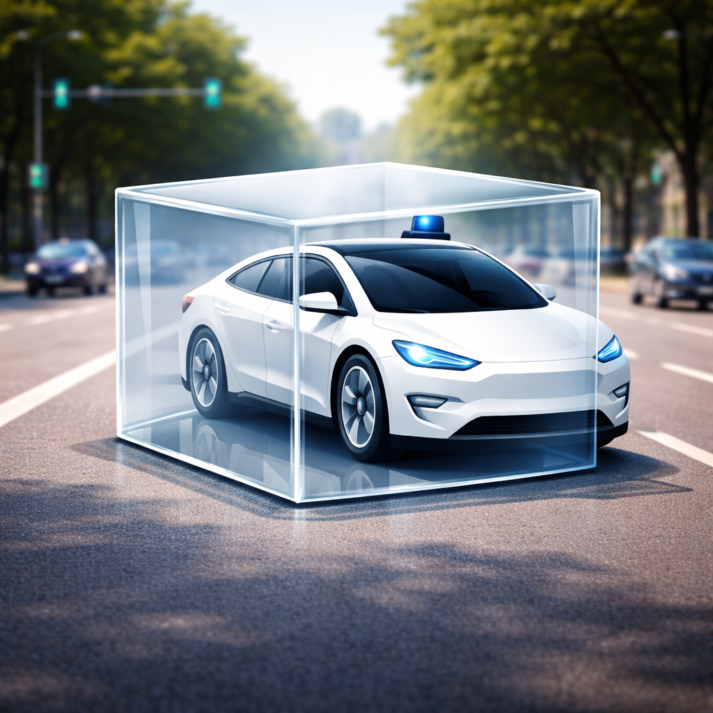

# Welcome

Welcome to the official site of the **White Box Autonomy**. A neutral archive of real-world autonomous driving events from actual users. Facts only. Run by an autonomous driving researcher with 10+ years of experience.

The **White Box Autonomy** aims to document what happens on the road in a factual and accessible way. The name reflects two ideas: the need for a “black box” equivalent for autonomous vehicles to preserve important events, and the belief that these events should not remain opaque or mysterious. Instead, they should be open, transparent, and visible — a white box, not a black one.

Contributions are welcome from anyone who would like to share autonomous driving-related events with the community. Please send your material to this email address (zuduo dot zheng at uq dot edu dot au) with the subject line “White Box Autonomy Contribution.” If your material is published, it will be properly credited.

{width="397"}

The White Box Autonomy Youtube Channel and X account can be found at the bottom of this page.

**Update**: to respond to its rapid growth, the White Box Autonomy Youtube Channel has been split into two: **the White Box Autonomy** and **the White Box Autonomy Archive**. While White Box Autonomy focuses on carefully produced videos, analysis, and original content, White Box Autonomy Archive serves as a repository for raw, unedited footage and reference material. The goal is to preserve authentic driving events in their original form for viewers, researchers, and anyone interested in autonomous driving systems and real-world human–AI interaction.
